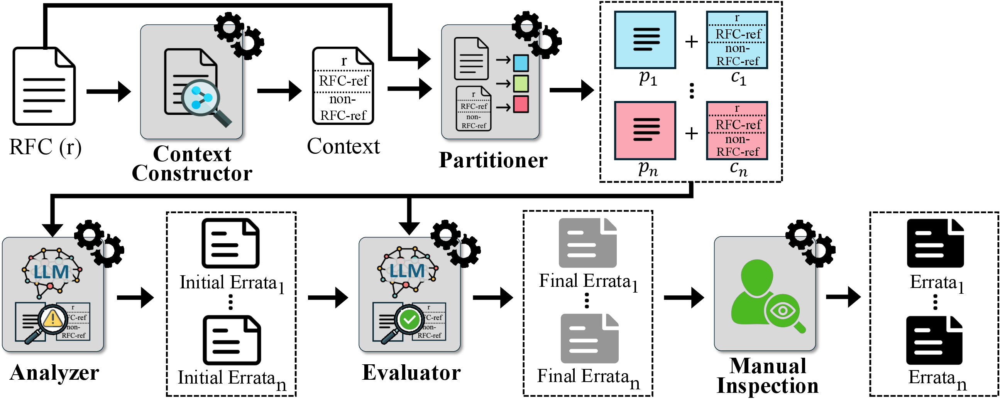
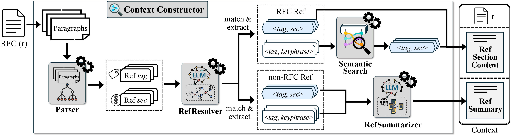

# RFCScope

**RFCScope: Detecting Logical Ambiguities in Internet Protocol Specifications**  
_Published in ASE 2025 — 40th IEEE/ACM International Conference on Automated Software Engineering_

[📄 Paper](https://ieeexplore.ieee.org/document/11334266) &nbsp;|&nbsp; [🎬 Video](http://mrigank.in/RFCScope-video) &nbsp;|&nbsp; [🖼 Poster](https://mrigank.in/media/ASE2025Poster.pdf) &nbsp;|&nbsp; [📊 Slides](https://mrigank.in/media/ASE2025Slides.pdf) &nbsp;|&nbsp; [🌐 Website](https://hiprel-group.github.io/RFCScope)

---

## What is RFCScope?

Internet protocol specifications, published as Requests for Comments (RFCs) by the IETF, are essential to ensuring the interoperability, security, and reliability of the Internet. However, ambiguities in these specifications — particularly _logical ambiguities_ such as inconsistencies and under-specifications — can lead to critical misinterpretations and implementation errors. Unfortunately, such ambiguities remain largely overlooked and challenging to detect with existing tools.

We present the **first systematic study** of verified technical errata from Standards Track RFCs over the past 11 years, identifying seven distinct subtypes of logical ambiguities. Building on these insights, we introduce **RFCScope**, the first scalable framework for detecting logical ambiguities in RFCs. RFCScope employs large language models (LLMs) through a modular pipeline that constructs targeted cross-document context, partitions specifications to preserve semantic integrity, applies bug-type-aware prompts for detection, and filters out false positives using structured reasoning validation.



---

## Key Results

- 🔍 **31 new logical ambiguities** found across 14 of the 20 most recent DNS RFCs
- ✅ **8 confirmed** by RFC authors
- 📋 **3 officially verified** as technical errata on the RFC Editor Errata Portal ([8426](https://www.rfc-editor.org/errata/eid8426), [8431](https://www.rfc-editor.org/errata/eid8431), [8590](https://www.rfc-editor.org/errata/eid8590))

---

## Taxonomy of Logical Ambiguities

Through manual analysis of **273 verified technical errata** from Standards Track RFCs (January 2014 – January 2025), we identified seven fine-grained subtypes of logical ambiguity:

| Category | Subtype | Description | Count |
| --- | --- | --- | --- |
| **Inconsistency** | I-1 | Direct inconsistency within or across specifications | 119 |
| | I-2 | Indirect inconsistency within or across specifications | 70 |
| | I-3 | Inconsistency with commonly accepted knowledge | 13 |
| **Under-specification** | U-1 | Undefined terms | 7 |
| | U-2 | Incomplete constraints (requires implementation feedback) | 15 |
| | U-3 | Indirect under-specification | 10 |
| | U-4 | Incorrect or missing references | 5 |

---

## How RFCScope Works

RFCScope is a four-stage LLM pipeline:

1. **Context Constructor** — Selectively extracts relevant content from all referenced documents (both RFC and non-RFC), using semantic search and LLM-powered summarization, so the model only sees what matters.
2. **Partitioner** — Semantically segments the RFC along its natural section hierarchy, keeping each chunk within the LLM's context window while preserving logical coherence.
3. **Analyzer** — Uses bug-type-aware prompts and chain-of-thought reasoning to detect potential ambiguities across all seven subtypes.
4. **Evaluator** — A second LLM pass independently re-validates each finding, rejecting hallucinated or out-of-scope reports before human review.



---

## This Repository

### `studied-errata/`

The errata considered in our empirical study, organized by subtype:

- `I-1/` — Contains the errata from the **Direct inconsistency** category (119 items).
- `I-2/` — Contains the errata from the **Indirect inconsistency** category (70 items).
- `I-3/` — Contains the errata from the **Inconsistency with common knowledge** category (13 items).
- `U-1/` — Contains the errata from the **Direct under-specification (undefined terms)** category (7 items).
- `U-2/` — Contains the errata from the **Direct under-specification (incomplete constraints)** category (15 items).
- `U-3/` — Contains the errata from the **Indirect under-specification** category (10 items).
- `U-4/` — Contains the errata from the **Incorrect/missing references** category (5 items).

Each file is named `Errata<id>-RFC<number>.md` and contains the original erratum text, RFC details, a link to the original errata report on the RFC Editor Errata portal, and our explanation. The errata belong to the Standards Track RFCs published from January, 2014 to January, 2025.

### `detected-bugs/`

The 31 new ambiguities detected by RFCScope across 14 RFCs, each with a bug report, categorization, and confirmation status:

- **Pending** — We have not yet reached out to the RFC authors regarding the bug.
- **Awaiting response from authors** — We have reached out to the RFC authors regarding the bug and are awaiting their response.
- **Confirmed by authors** — We received a response from the RFC authors confirming the bug.
- **Verified on the RFC Editor Errata portal** — The bug has been confirmed by the RFC authors, and is now submitted and verified on the RFC Editor Errata portal.

### `prompts/`

The prompt templates used in RFCScope:

- `system-prompts/inconsistency/` — Analyzer and Evaluator system prompts for inconsistency detection
- `system-prompts/under-specification/` — Analyzer and Evaluator system prompts for under-specification detection
- `user-prompts/` — Fillable user prompt templates for the Analyzer and Evaluator

### `RFCScope/`

The implementation of the RFCScope tool. See [`RFCScope/README.md`](RFCScope/README.md) for setup and usage instructions.

---

## Citing This Work

```bibtex
@inproceedings{rfcscope,
  author={Pawagi, Mrigank and Shao, Lize and Lee, Hyeonmin and Sun, Yixin and Wang, Wenxi},
  booktitle={2025 40th IEEE/ACM International Conference on Automated Software Engineering (ASE)}, 
  title={RFCScope: Detecting Logical Ambiguities in Internet Protocol Specifications}, 
  year={2025},
  doi={10.1109/ASE63991.2025.00106}
}
```
